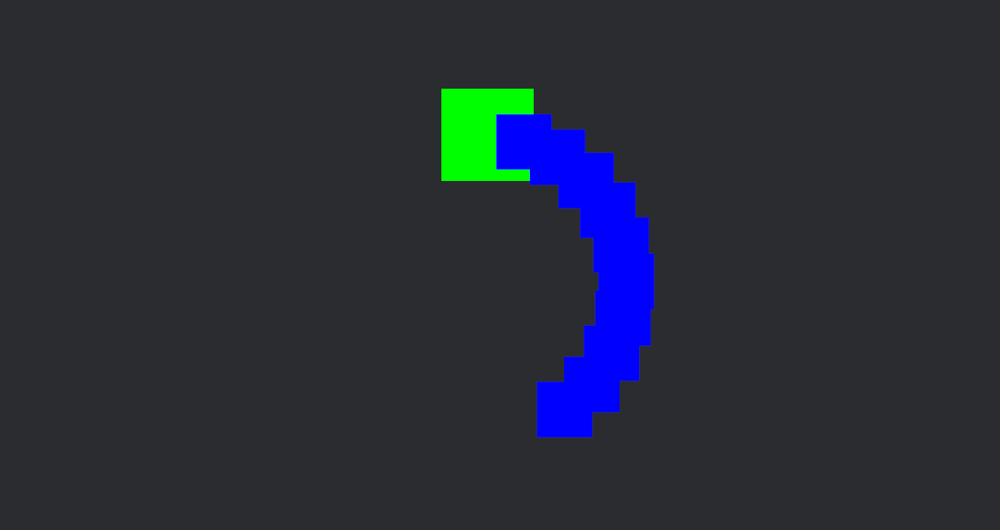

# WoRm

This project is an implementation of a worm (or snake) entity which is inspired by Terraria's Worm (more precisely, [The Devourer of Gods](https://calamitymod.wiki.gg/wiki/The_Devourer_of_Gods)).

The worm is a chain of segments that follow the head segment.


Yes, it's a worm. Michael is a worm. Michael is awful and he's a worm.

It's my first project in [Rust](https://www.rust-lang.org/fr) and [Bevy](https://bevyengine.org/), so be indulgent. I'm open to any advice or suggestion.
I've voluntarily leaved some comments (useful and useless).

## How to run the project?

### Prerequisites

- [Rust](https://www.rust-lang.org/fr)
- [Cargo](https://doc.rust-lang.org/cargo/getting-started/installation.html)

### Run the project

```
cargo run
```

## How do I've implemented the worm?

### First approach: linked list

In the file [worm_linked_list.rs](src/worm_linked_list.rs), I've tried to implement the worm as a linked list. Each segment has a reference to the next segment.

```
// Head is just a Tail with a Tag 
Tail -> Option<Tail>
```

### Second approach: worm and segments

In the file [worm_array.rs](src/worm_array.rs), I've implemented (and it works) the worm as a struct with a Vec of segments. I get the Worm struct and iterate over the segments to update their positions in correct order.

```
Worm -> Vec<Entity>
```

### Maybe a third approach?

I'm thinking about a third approach where the head and tails are separated. The head will emit an event when it moves and the tails will listen to this event to update their position. I don't know if it's a good idea.

## Inspired by

- https://github.com/bevyengine/bevy/issues/9228
- https://mbuffett.com/posts/bevy-snake-tutorial/